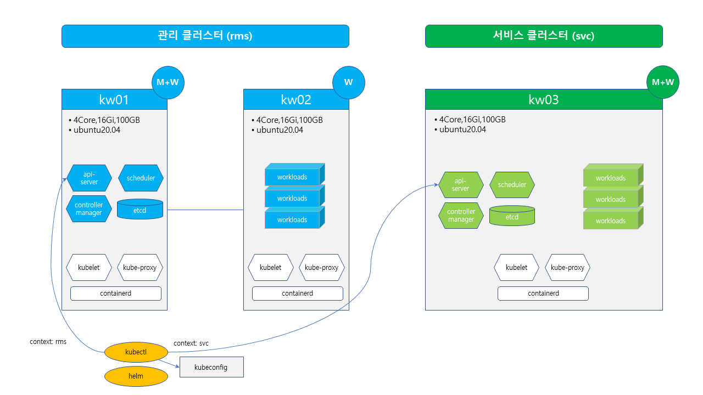

### Lab 1. Create RKE Cluster

---


---


- rke2 클러스터 (1 노드)를 설치하고 워커노드를 추가합니다.
- rke2 는 설치 스크립트를 이용하여 쉽게 설치할 수 있습니다.
- rancher에서 지원하는 클러스터 버전을 확인하고 해당 원하는 버전을 설치합니다. 
  (https://github.com/rancher/rancher/releases/tag/v2.7.3)

---

**1) RKE2 cluster 설치**

- rke2 설치 스크립트를 이용하여 설치합니다.
- 인터넷 연결이 가능한 환경에서 실행합니다.
- sudo 권한이 있는 사용자 계정과 4 Core, 16 Gi, 100 GB VM 3기를 준비합니다.

```bash

# vm에 로그인 후
$ sudo -i

# 클러스터 버전 지정 시 INSTALL_RKE2_VERSION 지정
# Rancher 2.7.3 버전은 RKE2 1.26 이하 버전 설치
$ curl -sfL https://get.rke2.io | INSTALL_RKE2_VERSION=v1.25.9+rke2r1 sh -

# (Optional) 최신버전 설치 시
$ curl -sfL https://get.rke2.io | sh -
```

- systemctl 로 rke2-server 서비스를 기동합니다.
- 설치 중 systemctl로 rke2-server 서비스 상태를 확인합니다.
- 설치 완료 후 kubeconfig 파일을 기본 위치에 복사합니다.


```bash
$ systemctl enable rke2-server --now
$ systemctl status -l rke2-server
$ journalctl -fa

# k8adm 계정을 생성합니다.
$ groupadd -g 2000 k8sadm
$ useradd -m -u 2000 -g 2000 -s /bin/bash k8sadm
$ echo -e "1\n1" | passwd k8sadm >/dev/null 2>&1
$ echo ' k8sadm ALL=(ALL)   ALL' >> /etc/sudoers

$ su - k8sadm # 사용자 계정으로 kubectl 실행환경을 설정합니다.
$ mkdir ~/.kube
$ sudo cp /etc/rancher/rke2/rke2.yaml ~/.kube/config
$ sudo chown k8sadm ~/.kube/config
$ sed -i 's/default/rke2/g'  ~/.kube/config
```

- kubectl / helm cli을 설치합니다.
- shell 환경 변수에 alias를 설정합니다.

```bash
$ curl -LO https://dl.k8s.io/release/v1.25.9/bin/linux/amd64/kubectl
$ chmod +x kubectl && sudo mv kubectl /usr/local/bin
$ curl https://raw.githubusercontent.com/helm/helm/main/scripts/get-helm-3 | bash

$ cat <<EOF >> ~/.bashrc
# k8s alias
source <(kubectl completion bash)
complete -o default -F __start_kubectl k

alias k=kubectl
alias kn='kubectl config set-context --current --namespace'
alias kc='kubectl config use-context'
alias kcg='kubectl config get-contexts'
alias di='docker images --format "table {{.Repository}}:{{.Tag}}\t{{.ID}}\t{{.Size}}\t{{.CreatedSince}}"'
alias kge="kubectl get events  --sort-by='.metadata.creationTimestamp'  -o 'go-template={{range .items}}{{.involvedObject.name}}{{\"\t\"}}{{.involvedObject.kind}}{{\"\t\"}}{{.message}}{{\"\t\"}}{{.reason}}{{\"\t\"}}{{.type}}{{\"\t\"}}{{.firstTimestamp}}{{\"\n\"}}{{end}}'"
EOF

$ source ~/.bashrc

$ k get nodes -o wide
```

---

**2) RKE2 Worker Node 추가**

- 위에서 설치한 RKE2 클러스터에 Worker Node를 연결합니다.
- 연결할 마스터노드의 IP 정보와 클러스터 토큰을 확인합니다.
- 연결 정보를 설정하고 rke2 설치 명령어를 통해 설치합니다.

```bash
# 마스터 노드의 IP 확인
$ ip a | grep inet

# 클러스터 토큰 확인
$ sudo cat /var/lib/rancher/rke2/server/token

# Worker Node에 ssh 접속
$ sudo -i
$ export INSTALL_RKE2_VERSION=v1.25.9+rke2r1
$ curl -sfL https://get.rke2.io | INSTALL_RKE2_TYPE="agent" sh -
$ mkdir -p /etc/rancher/rke2/
$ cat <<EOF >> /etc/rancher/rke2/config.yaml
server: https://마스터노드 IP:9345
token: 클러스터 토큰
EOF
$ systemctl enable rke2-agent.service --now
