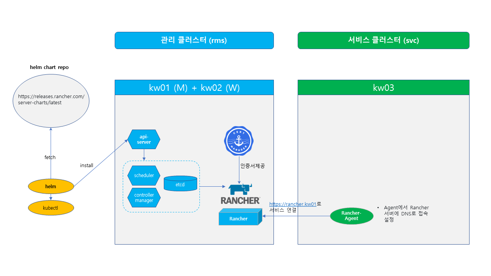

### Lab 2. Install Rancher for Managing Multi Clusters

- 생성된 클러스터에 Rancher를 helm chart를 이용하여 설치합니다.
- Rancher는 kubernetes 클러스터 관리를 위해 tls 통신을 기본으로 하여 cert-manager를 통한 인증서 관리가 필요합니다.
- 랜처로 관리할 새로운 서비스 클러스터를 생성합니다.
- 랜처가 설치된 클러스터는 관리 클러스터 역할을 하고, 다른 서비스 클러스터를 연결하여 멀티 클러스터 환경을 관리합니다. 



---

**1. Install Rancher**

```bash
# 설치할 클러스터의 노드 확인
$ kubectl get nodes


# ingress-controller 설치
$ helm repo add ingress-nginx https://kubernetes.github.io/ingress-nginx
$ helm repo update
$ helm upgrade -i ingress-nginx ingress-nginx/ingress-nginx -n ingress-nginx --create-namespace \
  --set controller.hostNetwork=true \
  --set controller.service.type=ClusterIP \
  --set controller.replicaCount=2

# cert-manager 설치
$ kubectl apply -f https://github.com/cert-manager/cert-manager/releases/download/v1.10.0/cert-manager.yaml

# Rancher helm 레파지토리 등록
$ helm repo add rancher-latest https://releases.rancher.com/server-charts/latest 

# Rancher 설치
# 원하는 도메인 명 등록 후 해당 도메인 명으로 접속
$ helm upgrade -i rancher rancher-latest/rancher \
  --set hostname=rancher.kw01 --set bootstrapPassword=admin \
  --set replicas=1 --set global.cattle.psp.enabled=false \
  --set ingress.ingressClassName=nginx \
  --create-namespace -n cattle-system

# Rancher 구동 확인
$ kubectl get pods -l app=rancher -A
$ kubectl rollout status deploy rancher -n cattle-system


# 접속할 PC hosts 파일에 Rancher host명 추가
# 윈도우즈 C:\Windows\System32\drivers\etc\hosts
# 10.2.100.100  rancher.kw01
랜처.서버.IP.명  rancher.kw01 # 설치시 등록한 도메인 명 등록
EOF  
```
- https://rancher.kw01 접속 (admin / admin)

---

