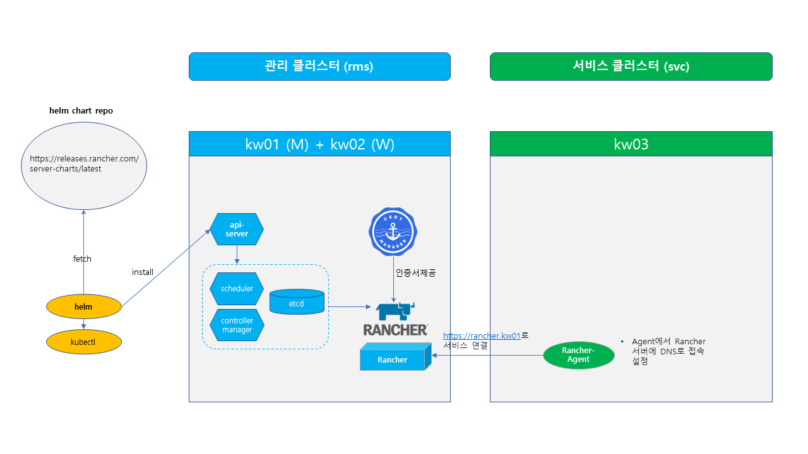

### Lab 2. Install Rancher with multi cluster management

- 생성된 클러스터에 Rancher를 helm chart를 이용하여 설치합니다.
- Rancher는 kubernetes 클러스터 관리를 위해 tls 통신을 기본으로 하여 cert-manager를 통한 인증서 관리가 필요합니다.
- 랜처로 관리할 새로운 서비스 클러스터를 생성합니다.
- 랜처가 설치된 클러스터는 관리 클러스터 역할을 하고, 다른 서비스 클러스터를 연결하여 멀티 클러스터 환경을 관리합니다. 



---

**1. Install Rancher**

```bash
# 설치할 클러스터의 노드 확인
$ kubectl get nodes

# cert-manager 설치
$ kubectl apply -f https://github.com/cert-manager/cert-manager/releases/download/v1.10.0/cert-manager.yaml

# Rancher helm 레파지토리 등록
$ helm repo add rancher-latest https://releases.rancher.com/server-charts/latest 

# Rancher 설치
# 원하는 도메인 명 등록 후 해당 도메인 명으로 접속
$ helm upgrade -i rancher rancher-latest/rancher \
--set hostname=rancher.kw01 --set bootstrapPassword=admin \
--set replicas=1 --set global.cattle.psp.enabled=false \
--create-namespace -n cattle-system

# Rancher 구동 확인
$ kubectl get pods -l app=rancher -A
$ kubectl rollout status deploy rancher -n cattle-system


# hosts 파일에 Rancher host명 추가
$ cat <<EOF | sudo tee /etc/hosts
# 10.2.100.100  rancher.kw01
랜처.서버.IP.명  rancher.kw01 # 설치시 등록한 도메인 명 등록
EOF
```
- https://rancher.kw01 접속 (admin / admin)

---

**2. Install Service Cluster**

- RKE2를 이용하여 새로운 1 node 클러스터를 생성합니다.
- VM3에 로그인하여 root 계정으로 작업합니다.

```bash

# 클러스터를 설치할 VM 로그인
# RKE2 설치
$ sudo -i
$ curl -sfL https://get.rke2.io | INSTALL_RKE2_VERSION=v1.24.13+rke2r1 sh -

# 클러스터 구동 확인
$ systemctl enable rke2-server --now &
$ systemctl status -l rke2-server
$ journalctl -fa

# 클러스터 접속 설정

$ groupadd -g 2000 k8sadm
$ useradd -m -u 2000 -g 2000 -s /bin/bash k8sadm
$ echo -e "1\n1" | passwd k8sadm >/dev/null 2>&1
$ echo ' k8sadm ALL=(ALL)   ALL' >> /etc/sudoers

$ su - k8sadm # 사용자 계정
$ mkdir ~/.kube
$ sudo cp /etc/rancher/rke2/rke2.yaml ~/.kube/config
$ sudo chown k8sadm ~/.kube/config
$ sed -i 's/default/rke2-svc/g'  ~/.kube/config

# kubectl cli 설치
$ curl -LO https://dl.k8s.io/release/v1.25.9/bin/linux/amd64/kubectl
$ chmod +x kubectl && sudo mv kubectl /usr/local/bin

```

---

**3. Rancher에 설치된 클러스터 Import**

- Rancher에 로그인 후 Cluster Import 기능으로 연결합니다.
- Rancher Login > Import Existing > Import Any Kubernetes Cluster - Generic 을 선택합니다.
- Cluster Name : svc > Create 를 실행합니다.
- Registration 화면의 2번째 명령어를 복사하여 생성된 클러스터에서 실행합니다.  
  *ex) "curl --insecure -sfL https://rancher.kw01/v3/import/vdhpnh5twscr54nbjsjjp7vhjltks6mjr9ppmx25rs4z7blrtzfz4t_c-m-wdghhcjm.yaml | kubectl apply -f -"*

```bash

# 연결할 클러스터 VM 접속

# hosts 파일에 Rancher host명 추가
$ cat <<EOF | sudo tee /etc/hosts
# 10.2.100.100  rancher.kw01
랜처.서버.IP.명  rancher.kw01 argocd.kw01 gitea.kw01 argo.kw01 # 설치시 등록한 도메인 명 등록
EOF

# 복사한 Registration 명령어 실행
$ curl --insecure -sfL https://rancher.kw01/v3/import/vdhpnh5twscr54nbjsjjp7vhjltks6mjr9ppmx25rs4z7blrtzfz4t_c-m-wdghhcjm.yaml | kubectl apply -f -

# host Alias 패치
$ cat <<EOF >> agent-patch.yml
spec:
  template:
    spec:
      hostAliases:
      - ip: 10.2.100.100
        hostnames:
        - rancher.kw01
EOF

$ kubectl patch deployment cattle-cluster-agent --patch-file agent-patch.yml -n cattle-system
```

