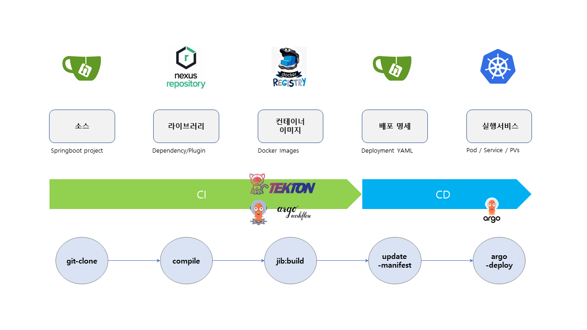

### Lab 4-1 Cloud Native CI/CD Toolchains

- Argo Workflow와 ArgoCD를 이용하여 Cloud Native CI/CD 환경을 구성합니다.
- Git clone -> maven build -> image push -> argo-deploy 순서로 빌드 프로세스는 진행됩니다.
- Gitea 의 Event를 통해서 파이프라인 구동을 자동화 합니다.

---

---

**1) Docker Registry 설치**

- CI/CD 빌드 후 컨테이너 이미지를 저장할 docker registry를 설치합니다.
- 공인인증서 대신 insecure 설정을 적용하고 containerd에 인증 정보를 등록합니다.

```bash
# Docker Registry Helm Chart 설치
$ helm repo add twuni https://helm.twun.io
$ helm fetch twuni/docker-registry

$ cat << EOF >> values.yaml
service:
  name: registry
  type: NodePort
  port: 5000
  nodePort: 30005
persistence:
  accessMode: 'ReadWriteOnce'
  enabled: true
  size: 10Gi
  storageClass: 'local-path'
EOF

$ helm install docker-registry -f values.yaml docker-registry-2.2.2.tgz -n registry --create-namespace

$ curl -v localhost:30005/v2/_catalog

# nerdctl download
$ wget https://github.com/containerd/nerdctl/releases/download/v1.3.1/nerdctl-full-1.3.1-linux-amd64.tar.gz
$ sudo tar Cxzvvf /usr/local nerdctl-full-1.3.1-linux-amd64.tar.gz

# nerdctl 설정
$ sudo mkdir -p /etc/nerdctl
$ cat << EOF | sudo tee /etc/nerdctl/nerdctl.toml
debug          = false
debug_full     = false
address        = "unix:///run/k3s/containerd/containerd.sock"
namespace      = "k8s.io"
cgroup_manager = "cgroupfs"
hosts_dir      = ["/etc/containerd/certs.d", "/etc/docker/certs.d"]
EOF

# admin / 1 로 로그인
$ sudo nerdctl --insecure-registry login 10.214.156.244:30005 # 노드IP 값으로 변경

# 컨테이너 런타임에 Private Registry 인증 / insecure 설정
# 레지스트리 주소를 자신의 주소로 변경합니다.
$ cat << EOF | sudo tee /etc/rancher/rke2/registries.yaml
mirrors:
  10.214.156.244:30005:
    endpoint:
      - http://10.214.156.244:30005
configs:
  10.214.156.244:30005:
    auth:
      username: admin 
      password: 1 
    tls:
      insecure_skip_verify: true
EOF

$ sudo systemctl restart rke2-server

# 아래 파일에 insecure 및 인증 설정 추가 확인 
$ sudo cat /var/lib/rancher/rke2/agent/etc/containerd/config.toml
```

---

**2) Gitea 설치**

```bash
$ kubectl apply -f - <<"EOF"
apiVersion: v1
kind: Namespace
metadata:
  name: "gitea"
---
apiVersion: apps/v1
kind: Deployment
metadata:
  namespace: gitea
  name: gitea
  labels:
    app: gitea
spec:
  replicas: 1
  selector:
    matchLabels:
      app: gitea
  template:
    metadata:
      labels:
        app: gitea
    spec:
      containers:
      - name: gitea
        image: gitea/gitea:1.16
        env:
        - name: GITEA__webhook__ALLOWED_HOST_LIST
          value: '*'
        ports:
        - containerPort: 3000
          name: gitea
        - containerPort: 22
          name: git-ssh
        volumeMounts:
        - mountPath: /data
          name: git-volume
      volumes:
      - name: git-volume
        persistentVolumeClaim:
          claimName: git-volume
---
apiVersion: v1
kind: PersistentVolumeClaim
metadata:
  namespace: gitea
  name: git-volume
spec:
  storageClassName: local-path
  accessModes:
    - ReadWriteOnce
  resources:
    requests:
      storage: 2Gi
---
apiVersion: v1
kind: Service
metadata:
  namespace: gitea
  name: gitea
spec:
  type: ClusterIP
  selector:
    app: gitea
  ports:
    - port: 3000
      targetPort: 3000
---
apiVersion: networking.k8s.io/v1
kind: Ingress
metadata:
  name: gitea
  namespace: gitea
spec:
  ingressClassName: nginx
  rules:
  - host: gitea.kw01
    http:
      paths:
      - backend:
          service:
            name: gitea
            port:
              number: 3000
        path: /
        pathType: Prefix
EOF
```

> host 파일에 gitea.kw01 argocd.kw01을 추가합니다.  
> rancher와 동일한 형태로 추가하면 됩니다.  
> 10.214.156.101 rancher.kw01 argocd.kw01 argo.kw01 gitea.kw01  

- http://gitea.kw01 에 접속합니다.
- server domain과 접속 URL을 http://gitea.kw01 로 설정하고 저장합니다.
- http://gitea.kw01에 접속하여 신규 계정을 생성합니다.
- 사용자 ID : argo / 패스워드 : 12345678
- argo 계정으로 로그인하여 New Migration으로 레파지토리를 import 합니다.
- https://github.com/flytux/kw-mvn.git
- https://github.com/flytux/kw-mvn-deploy.git

---

**3) ArgoCD 설치**

```bash
# ArgoCD 설치
$ kubectl create namespace argocd
$ kubectl apply -n argocd -f https://raw.githubusercontent.com/argoproj/argo-cd/stable/manifests/install.yaml

# Ingress Controller 설정 변경
$ kubectl edit ds -n kube-system rke2-ingress-nginx-controller

# 52 줄에 아래 내용 추가 : - --enable-ssl-passthrough
    - --watch-ingress-without-class=true
    - --enable-ssl-passthrough # 추가 내용
# 저장 :wq!

# Ingress 설정
$ kubectl -n argocd apply -f - <<"EOF"  
apiVersion: networking.k8s.io/v1
kind: Ingress
metadata:
  name: argocd-server-ingress
  namespace: argocd
  annotations:
    kubernetes.io/ingress.class: nginx
    nginx.ingress.kubernetes.io/force-ssl-redirect: "true"
    nginx.ingress.kubernetes.io/ssl-passthrough: "true"
spec:
  rules:
  - host: argocd.kw01
    http:
      paths:
      - path: /
        pathType: Prefix
        backend:
          service:
            name: argocd-server
            port:
              name: https
EOF

# ArgoCD 초기 패스워드 확인
$ kubectl -n argocd get secret argocd-initial-admin-secret -o jsonpath="{.data.password}" | base64 -d
```
- https://argocd.kw01 admin / 초기 패스워드로 로그인합니다.

```bash
# ArgoCD App 등록

$ kubectl -n argocd apply -f - <<"EOF"
apiVersion: argoproj.io/v1alpha1
kind: Application
metadata:
  name: kw-mvn
  namespace: argocd
spec:
  destination:
    namespace: deploy
    server: https://kubernetes.default.svc
  project: default
  source:
    path: dev
    repoURL: http://gitea.gitea:3000/argo/kw-mvn-deploy
    targetRevision: kust
  syncPolicy:
    syncOptions:
      - CreateNamespace=true
EOF
```

- 설치된 Argo App의 컨테이너이미지 주소를 설치한 Docker Registry 정보에 맞추어 변경합니다.
- https://gitea.kw01/argo/kw-mvn-deploy/src/branch/kust/base/deploy.yml
- 19번째 줄 아래와 같이 변경 후 Commit 합니다.

```bash
  # 설치된 자신의 Docker Registry 주소로 변경합니다.
  image: 10.214.156.101:30005/kw-mvn:init
  # 저장후 commit 합니다.
```
- https://gitea.kw01/argo/kw-mvn-deploy/src/branch/kust/dev/kustomization.yaml
- 9번째 줄 아래와 같이 변경 후 Commit 합니다.

```bash
  # 위와 동일하게 Docker Registry 주소로 변경합니다.
  - name: 10.214.156.101:30005/kw-mvn
  # 저장후 commit 합니다.
```  
---

**4) ArgoCD를 이용한 배포 자동화**
- 설치된 ArgoCD는 GitOps 레파지토리를 기준으로 변경된 형상을 동기화 합니다.
- ArgoCD 앱에는 Gitops 레파지토리 정보와 배포될 클러스터 정보가 포함되어 있습니다.
- 자동 동기화 설정 시 2분에 한번씩 레파지토리 변경 내용을 반영합니다.

```bash
# Git Source를 클론합니다.

$ cat << EOF | sudo tee -a /etc/hosts
10.214.156.101 gitea.kw01
EOF

$ git clone http://gitea.kw01/argo/kw-mvn 
$ cd kw-mvn

# maven 빌드를 이용하여 컨테이너 이미지를 생성합니다.
$ sudo nerdctl run -it --rm --name my-maven-project \
  -v "$(pwd)":/usr/src/kw-mvn -w /usr/src/kw-mvn \
  maven:3.3-jdk-8 mvn clean compile jib:build \
  -Dimage=10.214.156.101:30005/kw-mvn:init \
  -DsendCredentialsOverHttp=true \
  -Djib.allowInsecureRegistries=true
  
# 생성된 이미지 태그를 확인합니다.
$ curl -v 10.214.156.101:30005/v2/kw-mvn/tags/list

# Argo GitOps Repositoty의 이미지 Tag를 init으로 변경하고 Commit 합니다.
# http://gitea.kw01/argo/kw-mvn-deploy/src/branch/kust/dev/kustomization.yaml 10번째 줄

images:
- name: 10.214.156.101:30005/kw-mvn
  newTag: init

# ArgoCD에 로그인 해서 App을 동기화 합니다.
# https://argocd.kw01/applications/argocd/kw-mvn?view=tree&resource=
# Sync > Syncronize


