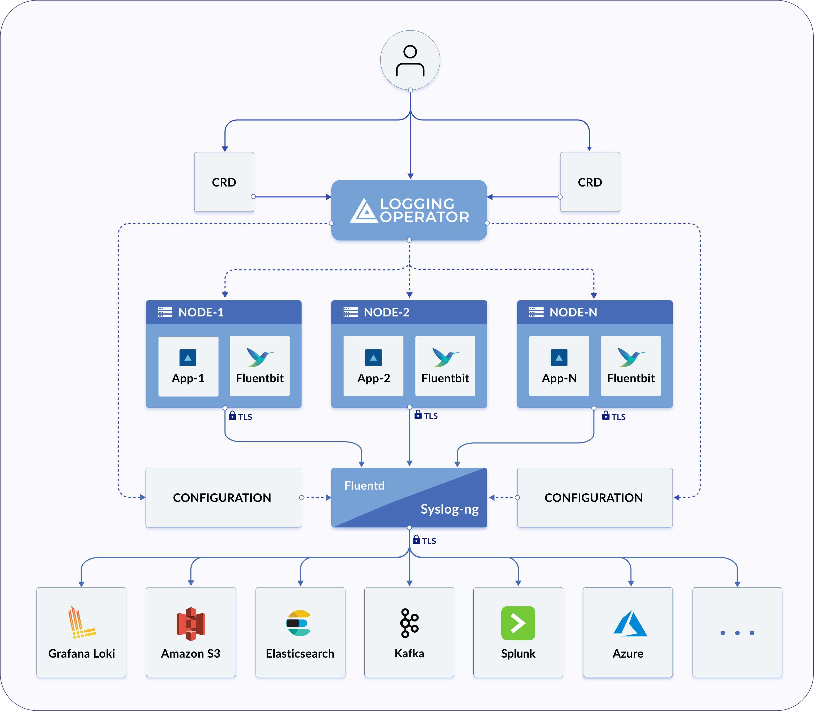

### Lab6. Cloud Workload Logging with Logging Operator / ElasticSearch

---



---

**1. Logging Operator 설정**

- Elastic Search / Logging Operator 설치

```bash
# Elastic Search 설치
$ kubectl create -f https://download.elastic.co/downloads/eck/2.8.0/crds.yaml
$ kubectl apply -f https://download.elastic.co/downloads/eck/2.8.0/operator.yaml

$ cat <<EOF | kubectl apply -f -
apiVersion: elasticsearch.k8s.elastic.co/v1
kind: Elasticsearch
metadata:
  name: quickstart
spec:
  version: 8.8.0
  nodeSets:
  - name: default
    count: 1
    config:
      node.store.allow_mmap: false
EOF

$ cat <<EOF | kubectl apply -f -
apiVersion: kibana.k8s.elastic.co/v1
kind: Kibana
metadata:
  name: quickstart
spec:
  version: 8.8.0
  count: 1
  elasticsearchRef:
    name: quickstart
EOF

# 로깅 오퍼레이터 설치
$ helm repo add kube-logging https://kube-logging.github.io/helm-charts
$ helm repo update
$ helm upgrade --install --wait --create-namespace --namespace logging logging-operator kube-logging/logging-operator

```

- Logging 객체 생성 및 로그 수집

```bash

# 로그 규칙을 적용할 새로운 Logging 객체 생성
kubectl -n logging apply -f - <<"EOF"
apiVersion: logging.banzaicloud.io/v1beta1
kind: Logging
metadata:
  name: default-logging-simple
spec:
  fluentd: {}
  fluentbit: {}
  controlNamespace: logging
EOF

# log output 생성  
kubectl -n logging apply -f - <<"EOF"
apiVersion: logging.banzaicloud.io/v1beta1
kind: Output
metadata:
  name: es-output
spec:
  elasticsearch:
    host: quickstart-es-http.logging.svc.cluster.local
    port: 9200
    scheme: https
    ssl_verify: false
    ssl_version: TLSv1_2
    user: elastic
    password:
      valueFrom:
        secretKeyRef:
          name: quickstart-es-elastic-user
          key: elastic
    buffer:
      timekey: 1m
      timekey_wait: 30s
      timekey_use_utc: true
EOF

#Log Flow 생성

$ kubectl -n logging apply -f - <<"EOF"
apiVersion: logging.banzaicloud.io/v1beta1
kind: Flow
metadata:
  name: es-flow
spec:
  filters:
    - tag_normaliser: {}
    - parser:
        remove_key_name_field: true
        reserve_data: true
        parse:
          type: nginx
  match:
     - select:
         labels:
           app.kubernetes.io/name: log-generator
  localOutputRefs:
    - es-output
EOF

#Log 생성기 설치
$ helm upgrade --install --wait --create-namespace --namespace logging log-generator kube-logging/log-generator 

# FluentD 로그 확인
$ kubectl exec -ti -n logging default-logging-simple-fluentd-0 -- tail -f /fluentd/log/out

```

- Kibana를 통한 로그 확인

```bash

# elastic user 패스워드 확인
$ kubectl -n logging get secret quickstart-es-elastic-user -o=jsonpath='{.data.elastic}' | base64 --decode; echo


# kibana svc nodeport 변경
$ k edit svc quickstart-kb-http
spec:
  type: NodePort

# Node Port 확인
$ k get svc

# kibana 패스워드 확인
$ kubectl -n logging get secret quickstart-es-elastic-user -o=jsonpath='{.data.elastic}' | base64 --decode; echo

``` 
- https://노드IP:노드포트

- user / 패스워드로 로그인
- discover / create data view / select index pattern "fluentd"
